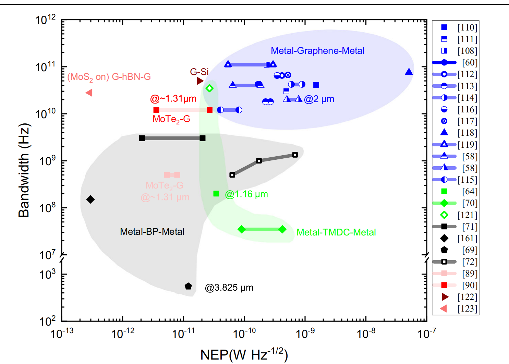
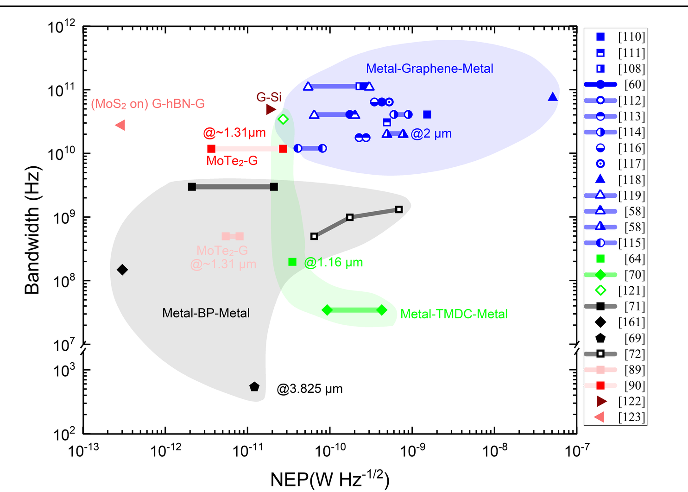
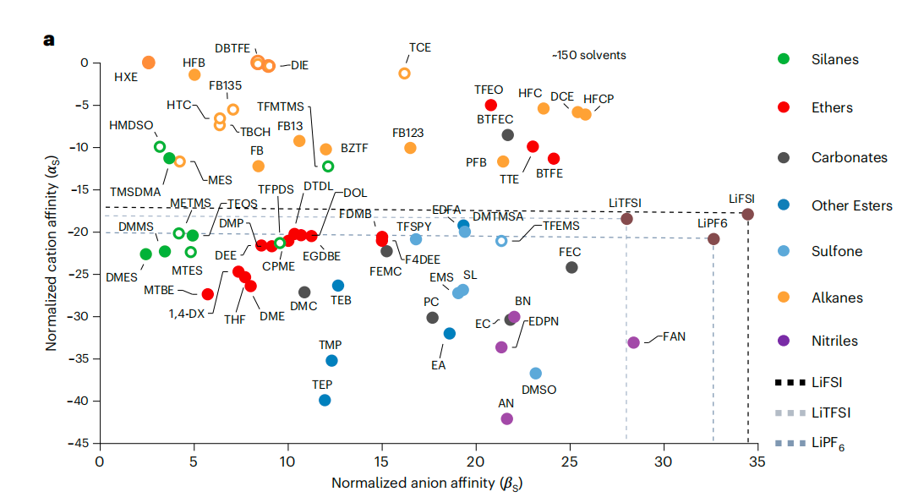
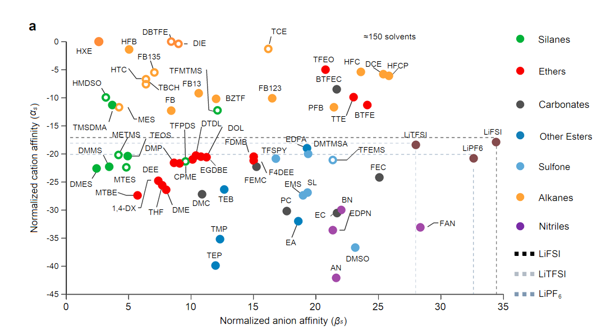
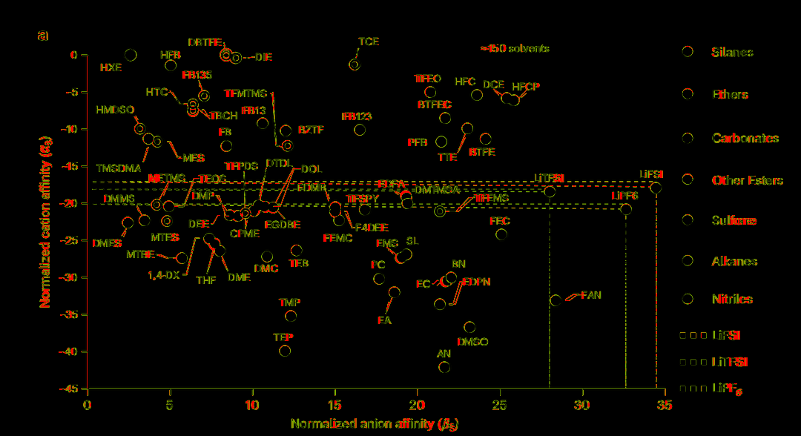
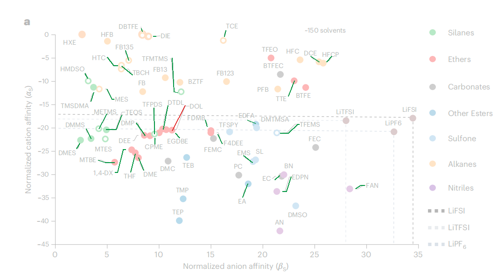

# Pixel Rebuild

用 Python 将栅格参考图重建为**独立、可编辑、可重复生成**的绘图代码，并通过像素差异、局部 ROI 和颜色区域指标持续校准结果。

这个项目关注的不是“把原图重新保存一遍”，而是从参考图中测量画布、坐标轴、曲线、填充区域、标记、文字和图例，再用 Pillow 或 Matplotlib 从零绘制。

## 案例 1：断轴与对数坐标综合图

| 重建前：参考图 | 重建后：Python 独立绘制 |
|---|---|
|  |  |

两张图片均为 `1485 × 1062`、RGB、约 240 DPI。右图由 [对应的完整重建脚本](scripts/rebuild_readme_example.py) 使用 Python 图元独立生成，运行时不读取左图。

可以直接复现右图：

```bash
python scripts/rebuild_readme_example.py --output rebuilt.png
```

### 示例中重建了什么

- 双区间断轴与对数坐标，包括主刻度、次刻度和断轴斜线
- 灰、蓝、绿三组平滑区域，以及区域交叠后的精确平面颜色
- 折线、端点、实心/空心/半填充圆、方形、菱形、三角形和五边形
- 科学计数法、上下标、化学式、单位和自由注释
- 25 行图例的边框、行中心、符号和文字排版
- 4 倍超采样、Lanczos 单次缩小和少量原生分辨率规则修正
- 输出尺寸、色彩模式、DPI 与确定性文件生成

### 示例验证结果

| 指标 | 结果 |
|---|---:|
| 画布 | `1485 × 1062` |
| 色彩模式 | `RGB` |
| DPI | `239.9792 × 239.9792` |
| 全图 MAE | `3.621176` |
| 全图 RMSE | `21.036276` |
| 完全一致像素 | `88.754462%` |
| 最大通道误差不超过 5 的像素 | `93.637632%` |
| 重复生成 | 两次输出 SHA-256 完全相同 |

完整一致像素比例容易受到大面积白色背景影响，因此工具还会计算指定 ROI 和平面颜色 IoU。字体栅格器、字形文件和抗锯齿实现不同，也可能在文字边缘产生局部差异。

## 案例 2：溶剂亲和力散点图

这是本仓库的案例 2：一张 `1080 x 588` 的密集科学图，包含实心/空心标记、三组虚线阈值、大量标签与短引线、数学下标、ClearType 风格子像素文字和混合图例。

| 原图 | Python 独立重建 |
|---|---|
|  |  |

### 逐像素差异热力图



### 引线源像素证据审计



绿色路径达到默认证据支持阈值；红色路径需要结合局部裁剪、遮挡关系和逐条消融继续审查，不会被脚本自动删除。本案例 36 条候选引线中，35 条达到 `0.40` 支持率阈值，1 条标记为 `review`。

| 指标 | 结果 |
|---|---:|
| MAE | `4.643836` |
| RMSE | `23.993312` |
| 完全一致像素 | `90.048501%` |
| 通道误差不超过 5 | `92.512125%` |
| 不同像素数 | `63,196` |
| 无参考图重复渲染 | 两次 SHA-256 完全相同 |

这次实战建立了一套更严格的证据链：

- 逐条删除引线并重新渲染，用消融试验判断线条是帮助还是造成误差
- 分离原图灰阶像素并膨胀 `1-2 px`，计算候选引线的像素证据支持率
- 用逐行扫描恢复 `1,4-DX` 等斜线的真实中心线，而不是凭缩略图猜测
- 用 3 个水平子样本、5-tap 滤波和 gamma 近似 LCD 子像素文字
- 先拟合标签组的共同 `1/3 px` 基线相位，再保留少量单标签水平偏移
- 在 4 倍超采样之后恢复实测的标记平面色核心、坐标轴单像素核心和图例 `6 x 7` 矩形
- 识别 `≈` 与 `~` 这类预览中很像、但字形宽度和抗锯齿完全不同的字符

完整代码与证据：

- [独立渲染脚本](scripts/cases/recreate_solvent_affinity.py)
- [完整案例复盘、算法和踩坑记录](references/solvent-affinity-case-study.md)
- [逐像素指标 JSON](assets/cases/solvent-affinity/metrics.json)
- [50% 叠加图](assets/cases/solvent-affinity/overlay.png)
- [4 倍增强绝对差异](assets/cases/solvent-affinity/difference_x4.png)
- [非零差异二值图](assets/cases/solvent-affinity/error_mask.png)
- [引线候选坐标](assets/cases/solvent-affinity/leaders.json)
- [引线证据逐条报告](assets/cases/solvent-affinity/line-evidence.json)

## “1:1 重建”是什么意思

本项目把 1:1 作为以下目标：

1. 使用与参考图相同的原生画布尺寸和输出元数据。
2. 用代码描述并重绘参考图的语义结构，而不是复制参考图像素。
3. 对几何、颜色、线宽、符号、文字和抗锯齿进行逐轮测量与校准。
4. 用可复现的指标和差异图诚实报告剩余误差。

以下方式不属于重建：

- 将参考图编码为 Base64 后嵌入脚本
- 导出参考图像素到 CSV，再覆盖到背景图
- 裁切参考图中的文字、图例或曲线并重新拼贴
- 把参考图作为隐藏底图，再在上面画少量内容

判断方法很简单：暂时移走参考图后，重建脚本仍然必须能够完整生成结果。

## 工作流程

```text
原始参考图
    ↓
原生尺寸观察 + 主色/边界/扫描线测量
    ↓
拆分画布、区域、坐标系、曲线、符号、文字和图例
    ↓
Python 图元独立重绘
    ↓
4× 超采样并单次缩小
    ↓
全图指标 + ROI 指标 + 颜色 IoU + 差异热力图
    ↓
按几何 → 色块 → 线条/符号 → 字体 → 抗锯齿的顺序迭代
    ↓
重复生成、哈希验证和最终交付
```

## 安装

将仓库安装到 Codex 的个人 Skills 目录：

```bash
git clone https://github.com/QuanShengLi0508/pixel-rebuild.git
cp -R pixel-rebuild "${CODEX_HOME:-$HOME/.codex}/skills/pixel-rebuild"
```

依赖：

```bash
python -m pip install -r requirements.txt
```

## 使用 Skill

上传参考图后直接调用：

```text
使用 $pixel-rebuild，用 Python 1:1 复刻这张图。
```

Skill 会读取 [SKILL.md](SKILL.md) 中的完整工作约束，并持续完成测量、编码、渲染、对比、迭代和验证，而不是只提供一份实现建议。

## 配套工具

### 1. 测量参考图

```bash
python scripts/inspect_reference.py reference.png \
  --top-colors 20 \
  --top-lines 12 \
  --scan-x 179 \
  --scan-y 56 \
  --json inspection.json
```

输出包括：

- 尺寸、模式、DPI 和 ICC Profile 信息
- 主色频次、比例和精确颜色包围盒
- 非白内容包围盒
- 深色覆盖最强的行列
- 指定扫描线上的连续像素区间

### 2. 比较重建结果

```bash
python scripts/compare_reconstruction.py reference.png recreated.png \
  --output-dir comparison \
  --roi plot:179,56,1246,938 \
  --roi legend:1260,60,1397,919 \
  --color 230,230,230 \
  --color 0,0,255 \
  --json comparison/metrics.json
```

它会生成：

- `overlay.png`：原图和重建图的 50% 叠加
- `heatmap.png`：误差强度热力图
- `difference_x4.png`：放大 4 倍的 RGB 绝对差异
- `error_mask.png`：所有非零差异像素的二值图
- 全图与 ROI 的 MAE、RMSE、误差分位数和一致像素比例
- 指定平面颜色的像素数量与交并比 IoU

比较工具遇到尺寸不一致时会直接失败，不会通过偷偷缩放图片来掩盖问题。

### 3. 审计候选引线

先把候选折线保存为 JSON：

```json
{
  "paths": [
    {"name": "label-a", "points": [[302, 61], [304, 67]]},
    {"name": "label-b", "points": [[229, 122], [243, 140], [252, 140]]}
  ]
}
```

然后在原图上检测等通道灰阶像素证据：

```bash
python scripts/audit_line_evidence.py reference.png candidate-paths.json \
  --radius 2 \
  --support-threshold 0.40 \
  --json line-evidence.json \
  --visualization line-evidence.png
```

脚本会为每条路径输出原始支持像素数、膨胀后支持像素数、支持率和 `supported/review` 分类。它是快速筛查器，不是自动删线器：文字、标记或虚线可能造成假支持，后绘制的点也可能遮挡真实引线。

### 4. 运行完整绘图示例

```bash
python scripts/example_pillow_reconstruction.py --output example_reconstruction.png
```

[完整示例脚本](scripts/example_pillow_reconstruction.py) 展示了：

- Pillow 原生坐标与 4 倍超采样坐标的分离
- 对数映射和分段断轴
- Catmull-Rom 平滑闭合区域
- 明确绘制交叠颜色而不是盲目透明混合
- 半填充圆形的遮罩实现
- 科学计数法与上下标的分段排版
- 数据化图例和符号复用
- 原生分辨率后处理和 PNG DPI 保存

此外，[README 效果图重建脚本](scripts/rebuild_readme_example.py) 是上方实际对比案例的完整实现，包含全部 25 行图例和针对目标图逐项测量后的坐标、颜色、字体与符号参数。

[溶剂亲和力实战脚本](scripts/cases/recreate_solvent_affinity.py) 则演示了密集散点图的 LCD 子像素文字、逐条引线消融、灰阶证据支持率和原生分辨率核心修正。

## 实战经验

重建最容易卡在“看起来差不多，但指标不再提升”的阶段。[实战踩坑清单](references/pitfalls.md) 记录了本项目实际遇到的问题，包括：

- 旧脚本或旧输出与当前参考图不对应
- 预览缩放导致坐标测量错误
- Pillow 矩形端点包含和半像素对齐
- 密集散点图中看似合理、实际不存在的标注引线
- 用逐条消融和灰阶证据廊道区分“线不存在”与“线画错了”
- 重复缩放造成的模糊
- 交叠区域的平面颜色与透明混合差异
- 断轴的分段映射
- 空白背景抬高全图一致率
- 空心、实心和半填充标记的视觉尺寸差异
- 字体路径、字形回退、上下标和跨平台抗锯齿
- PNG DPI 的像素/米换算误差
- Skill 校验器与绘图运行时的依赖差异

更完整的方法说明见 [重建手册](references/reconstruction-playbook.md)。
溶剂亲和力图的完整迭代记录见 [案例 2 复盘](references/solvent-affinity-case-study.md)。

## 目录结构

```text
pixel-rebuild/
├── SKILL.md
├── README.md
├── requirements.txt
├── agents/
│   └── openai.yaml
├── assets/
│   ├── examples/
│   │   ├── reference.png
│   │   └── python-reconstruction.png
│   └── cases/
│       └── solvent-affinity/
│           ├── difference_x4.png
│           ├── error_mask.png
│           ├── heatmap.png
│           ├── leaders.json
│           ├── line-evidence.json
│           ├── line-evidence.png
│           ├── metrics.json
│           ├── overlay.png
│           ├── reference.png
│           └── reconstruction.png
├── references/
│   ├── pitfalls.md
│   ├── reconstruction-playbook.md
│   └── solvent-affinity-case-study.md
└── scripts/
    ├── cases/
    │   └── recreate_solvent_affinity.py
    ├── audit_line_evidence.py
    ├── compare_reconstruction.py
    ├── inspect_reference.py
    ├── example_pillow_reconstruction.py
    └── rebuild_readme_example.py
```

## 交付标准

一次完整任务应至少交付：

- 可独立运行的 Python 绘图脚本
- 脚本生成的最终图片
- 与参考图一致的目标尺寸、模式和必要元数据
- 全图及关键区域的对比指标
- 可视化差异文件或关键局部检查结果
- 两次运行输出哈希一致的确定性验证

最终报告应明确区分“原生画布一致”“视觉高相似”和“逐字节完全一致”，不使用零差异数据搬运来冒充代码重建。
